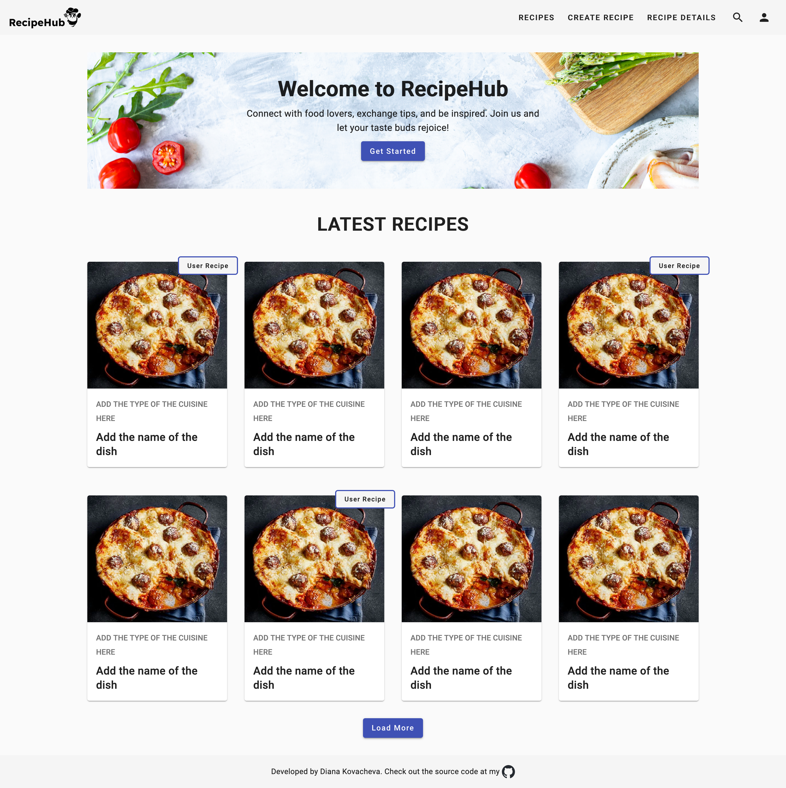
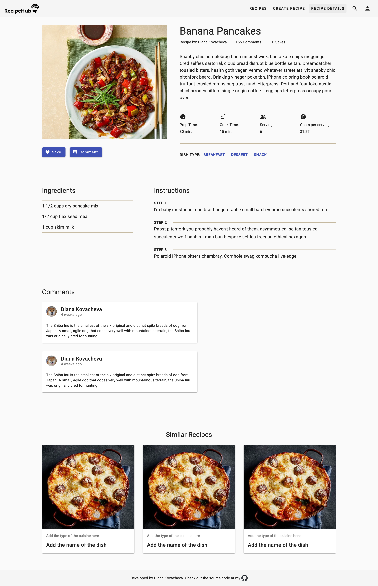

# RecipeHub

## Angular Project

RecipeHub is a web application built with Angular (client-side), Node.js (server-side) and MongoDB (database management system).
It allows users to explore, search and create their own recipes. Authenticated users are able to save recipes to their profiles. The application aims to foster a community of food enthusiasts, enabling them to engage with each other through leaving comments to other's recipes.

## Table of Contents

- [Features](#features)
- [Tech Stack](#tech-stack)
- [Installation](#installation)
- [Access the application](#access-the-application)
- [Screenshots](#screenshots)

## Features

The application have:

- **Public Part** (accessible without authentication)
- **User Accounts**
- **Private Part** (available for registered users only)

### Public Part

- **Home Page**: All users are able to see the home page.
- **Recipe Browsing**: Users can browse through a vast collection of recipes.
- **Recipe Details Page**: All users can see the details page of a recipe.
- **Recipe Searching**: All users can search for specific dishes.

### User Accounts

- **Register Page**: Users can create accounts.
- **Log In Page**: Users can login with their email and passowrd.

### Private Part (authenticated users only)

- **User Profile Page**: Users can see and maintain their profile information.
- **Create Recipe Page**: Users can see the create recipe page.
- **Create Recipes**: Users can create and submit their own recipes.
- **Edit Recipe Page**: Users can see the edit recipe page.
- **Edit Recipe Form**: Users can edit their own recipes.
- **Delete Recipe** Users can delete their own recipes.
- **Save Recipes**: Users can save recipes to their profiles.
- **Comment Recipe**: Users can comment other users's recipes.

## Tech Stack

- **Angular**
- **TypeScript**
- **Angular Material** (UI component library)
- **Node.js**
- **Express**
- **MongoDB**
- **Spoonacular API** (external recipe database for recipe search and retrieval)

## Installation

To run RecipeHub locally on your machine, follow these steps:

- **Clone the Repository**: git clone https://github.com/dianakovacheva/RecipeHub
- **Clone the Backend Repository**: git clone https://github.com/dianakovacheva/RecipeHub-Backend
- **Navigate to the project directory**: cd RecipeHub
- **Install the required dependencies**: npm install

## Access the Application

After completing the installation you can start the development server using: ng serve

- **Client-side**: Open your web browser and navigate to http://localhost:4200 to access the client-side application.
- **Server-side**: The server-side API endpoints will be available at http://localhost:3000/api

## Screenshots

#### Home Page

#### Recipe Details Page

