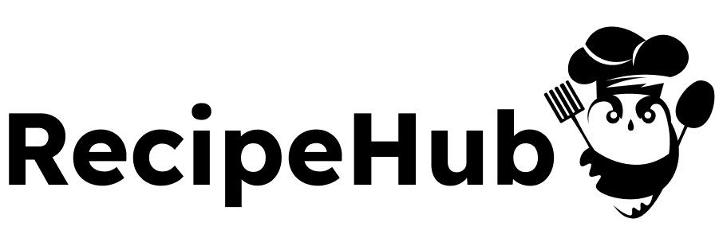

# RecipeHub

## Angular Project

RecipeHub is a web application built with Angular (client-side), Node.js (server-side) and MongoDB (database management system).
It allows users to explore, search and create their own recipes. Authenticated users are able to save recipes to their profiles. The application aims to foster a community of food enthusiasts, enabling them to engage with each other through leaving comments to recipes.

## Table of Contents

- [Features](#features)
- [Tech Stack](#tech-stack)
- [Installation](#installation)
- [Access the application](#access-the-application)
- [Screenshots](#screenshots)

## Features

The application have:

- **Public Part** (accessible without authentication)
- **Private Part** (available for registered users only)

### Public Part

- **Home Page**: All users are able to see the home page.
- **Recipe Catalog**: Users can browse through a vast collection of recipes.
- **Recipe Details Page**: All users can see the details page of a recipe.
- **Recipe Searching**: All users can search for recipes by title, summary and ingredients.
- **Register Page**: Users can create accounts.
- **Log In Page**: Users can login with their email and passowrd.

### Private Part (authenticated users only)

#### User Profile Page

- **Personal Information**: Users can see their profile information like their first name, last name and their email address. Additionally an avatar including their initials is shown next to their personal information.
- **My Recipes**: List of all recipes created by the user.The user can edit and delete his recipes.
- **Saved Recipes**: List of all recipes the user have saved to his profile. The user is able to remove saved recipes from this list.
- **Comments**: List of all comments written by the user. The recipe comments are shown on recipe details page and user's profile page. By deleting the comments from user's profile page, the comments will be automatically removed from both pages.

#### Create Recipe Page

- **Create Recipes Form**: Users can create and submit their own recipes.
- **Edit Recipe Form**: Users can edit their own recipes.
- **Delete Recipe** Users can delete their own recipes.
- **Save Recipes**: Users can save recipes to their profiles.
- **Comment Recipe**: Users can comment recipes.

#### UI notifications for successful or failed operations

## Tech Stack

- **Angular**
- **TypeScript**
- **Angular Material** (UI component library)
- **Node.js**
- **Express**
- **MongoDB (Mongoose)**
- **Moment.js**

## Installation

To run RecipeHub locally on your machine, follow these steps:

### Start Backend Server

- **Clone the Backend Repository**: git clone https://github.com/dianakovacheva/RecipeHub-Backend
- **Navigate to the project directory**: cd RecipeHub-Backend
- **Install the required dependencies**: npm install
- **Start the server**: npm start

### Start Frontend Server

- **Clone the Repository**: git clone https://github.com/dianakovacheva/RecipeHub
- **Navigate to the project directory**: cd RecipeHub
- **Install the required dependencies**: npm install
- **Start the server**: ng serve

## Access the Application

After completing the installation you can start the development server using: ng serve

- **Client-side**: Open your web browser and navigate to http://localhost:4200 to access the client-side application.
- **Server-side**: The server-side API endpoints will be available at http://localhost:3000/api

## Screenshots

#### Home Page

Not logged in view

#### Login Page

#### Notification Snack Bar

UI notifications for successful or failed operations

#### Register Page

#### Recipe Catalog Page

#### Recipe Details Page

#### Create Recipe Page

#### Edit Recipe Page

#### Notification Dialog Before Deleting Recipe

#### Leave Comments Form

With no comments under it

#### Users Comments Section

#### User Profile Page

